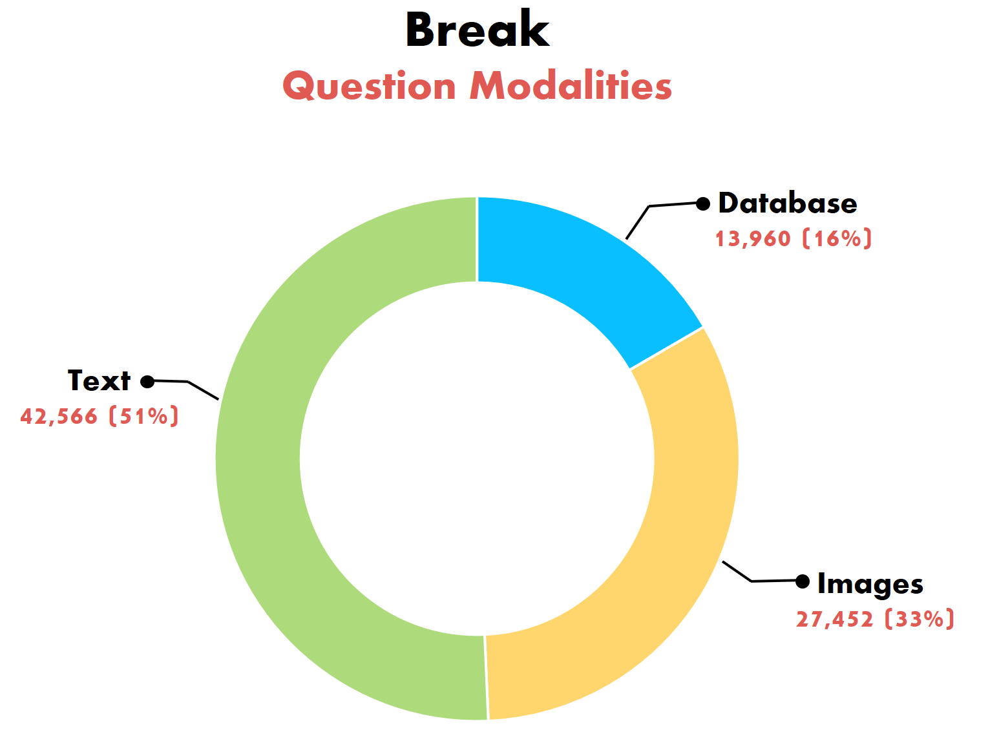
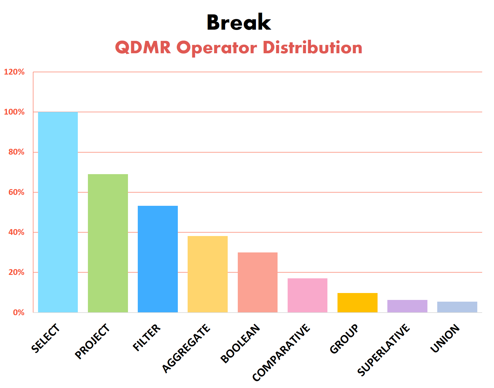

## **MoNaCo: More Natural Questions for Reasoning Across Dozens of Documents**

- *Check out [our blogpost](https://medium.com/ai2-blog/break-mapping-natural-language-questions-to-their-meaning-representation-31bb753701d6) at the official [Ai2 blog!](https://medium.com/ai2-blog)*  

We introduce **MoNaCo**, a benchmark of **Mo**re **Na**tural and **Co**mplex questions to evaluate the question-answering (QA) skills of language models. MoNaCo contains 1,315 time-consuming questions whose solutions involve combining and reasoning over information spanning across dozens of Wikipedia tables and passages.

Large language models (LLMs) are emerging as the go-to tool for answering questions and surfacing hard-to-find information. While LLMs (and LLM-powered applications such as [Deep Research](https://gemini.google/overview/deep-research/)) hold great promise in solving problems that require combining knowledge from hundreds of sources, such problems are poorly represented in most model evaluation benchmarks. Existing QA benchmarks rarely feature realistic questions that are both fact-reliant and genuinely time-intensive for humans to answer. Instead, most benchmark questions are too simplistic, requiring only a handful of evidence documents, while the more complex QA benchmarks are typically machine-generated—which may result in contrived and unnatural questions.

MoNaCo addresses this gap, presenting realistic questions whose solution spans up to hundreds of documents. Furthermore, it reveals key limitations in the question-answering abilities of frontier LLMs.

    

In our experiments, we tested 15 frontier LLMs on MoNaCo, including GPT-5, o3, Claude Opus 4, Gemini 2.5 Pro, and Deepseek-R1. All models struggled, with the top-performing LLM, o3, reaching an F1 score of 61.2% while answering only 38.7% of examples with a perfect score.

We also observe that as solutions to questions entail reasoning over more intermediate answers or require more evidence sources, model performance decreases substantially.

    

### About the MoNaCo Benchmark

We created MoNaCo as a QA benchmark with questions that are:  

1. **Realistic**, reflecting the information-seeking goals of real-world users
2. **Time-consuming**, with questions that cannot be answered without potentially hundreds of intermediate facts

For example, while the two MoNaCo questions below have succinct answers, they both require dozens of fact-finding steps:

    

Overall, MoNaCo has 1,315 questions whose solutions involve many intermediate steps that span across dozens, and at times hundreds, of evidence documents. Compared to traditional QA benchmarks, the scope of MoNaCo questions is much broader. To solve them, models must be proficient at decomposing complex queries, locating hundreds of pieces of information, and reasoning, combining, and aggregating this data effectively.

MoNaCo’s breadth and depth makes it ideal as an LLM benchmark for at least five different settings:

* Evaluating models’ **parametric knowledge** and reasoning
* Measuring complex **reasoning over long contexts**, where all of the evidence docs are provided in the context
* **Multi-document retrieval** performance
* End-to-end **retrieval-augmented generation** (RAG)
* **Training Deep Research-like systems**, using the gold standard reasoning chains

### The Data

QDMR serves as the formalism for creating Break, a dataset aimed at probing question understanding models. It features 83,978 natural language questions, annotated with their Question Decomposition Meaning Representations. Break contains human composed questions, sampled from 10 leading question-answering benchmarks:

* **Semantic Parsing**: [Academic](https://github.com/jkkummerfeld/text2sql-data), [ATIS](https://github.com/jkkummerfeld/text2sql-data), [GeoQuery](https://github.com/jkkummerfeld/text2sql-data), [Spider](https://yale-lily.github.io/spider)
* **Visual Question Answering**: [CLEVR-humans](https://cs.stanford.edu/people/jcjohns/clevr/), [NLVR2](http://lil.nlp.cornell.edu/nlvr/)
* **Reading Comprehension (and KB-QA)**: [ComQA](http://qa.mpi-inf.mpg.de/comqa/), [ComplexWebQuestions](https://www.tau-nlp.org/compwebq), [DROP](https://allennlp.org/drop), [HotpotQA](https://hotpotqa.github.io/)  

Break was collected through crowdsourcing, with a user interface that allows us to train crowd workers to produce quality decompositions. Validating the quality of annotated structures reveals 97.4% to be correct. Our paper ["Break It Down: A Question Understanding Benchmark"](https://allenai.github.io/Break/#paper), accepted for publication in [TACL](https://transacl.org/index.php/tacl), has a full description of the data collection process. To see some more examples from the dataset, please check out [the Break website](https://allenai.github.io/Break/).   

We present some statistics of the question types and operators found in Break examples. Operator distribution, in particular, helps illustrate the reasoning types required by different QA tasks. For the full statistics of Break please refer to our [dataset repository](https://github.com/allenai/Break).

    

    

### The *"Break It Down!"* Challenge

Break is aimed at building systems that parse natural questions into their respective QDMR representations. We hope that this dataset, and its QDMR parsing challenge, will spur the development of future question understanding models. We encourage the NLP community to treat Break also as a resource for building better question answering systems.  

Our research has shown that multi-hop QA models, using Break decompositions, greatly outperform a strong BERT-based baseline, which does not. Additionally, we provide [neural QDMR parsing models](https://allenai.github.io/Break/#leaderboard), trained on Break, that beat a rule-based baseline that employs dependency parsing and coreference resolution.  
Visit the [Break website](https://allenai.github.io/Break/) to view the leaderboard and learn more.

[1] Francis Jeffry Pelletier. 1994. "The principle of semantic compositionality." *Topoi, 13(1):11–24*.
