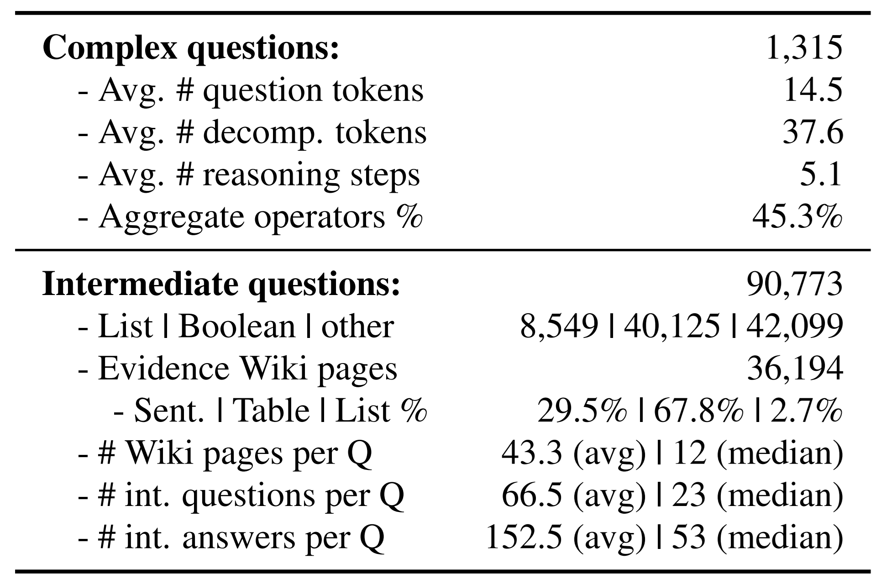

## **MoNaCo: More Natural Questions for Reasoning Across Dozens of Documents**

- *Check out [our blogpost](https://medium.com/ai2-blog/break-mapping-natural-language-questions-to-their-meaning-representation-31bb753701d6) at the official [Ai2 blog!](https://medium.com/ai2-blog)*  

We introduce **MoNaCo**, a benchmark of **Mo**re **Na**tural and **Co**mplex questions to evaluate the question-answering (QA) skills of language models. MoNaCo contains 1,315 time-consuming questions whose solutions involve combining and reasoning over information spanning across dozens of Wikipedia tables and passages.

Large language models (LLMs) are emerging as the go-to tool for answering questions and surfacing hard-to-find information. While LLMs (and LLM-powered applications such as [Deep Research](https://gemini.google/overview/deep-research/)) hold great promise in solving problems that require combining knowledge from hundreds of sources, such problems are poorly represented in most model evaluation benchmarks. Existing QA benchmarks rarely feature realistic questions that are both fact-reliant and genuinely time-intensive for humans to answer. Instead, most benchmark questions are too simplistic, requiring only a handful of evidence documents, while the more complex QA benchmarks are typically machine-generated—which may result in contrived and unnatural questions.

MoNaCo addresses this gap, presenting realistic questions whose solution spans up to hundreds of documents. Furthermore, it reveals key limitations in the question-answering abilities of frontier LLMs.

    

In our experiments, we tested 15 frontier LLMs on MoNaCo, including GPT-5, o3, Claude Opus 4, Gemini 2.5 Pro, and Deepseek-R1. All models struggled, with the top-performing LLM, o3, reaching an F1 score of 61.2% while answering only 38.7% of examples with a perfect score.

We also observe that as solutions to questions entail reasoning over more intermediate answers or require more evidence sources, model performance decreases substantially.

    

### **About the MoNaCo Benchmark**

We created MoNaCo as a QA benchmark with questions that are:  

1. **Realistic**, reflecting the information-seeking goals of real-world users
2. **Time-consuming**, with questions that cannot be answered without potentially hundreds of intermediate facts

For example, while the two MoNaCo questions below have succinct answers, they both require dozens of fact-finding steps:

    

Overall, MoNaCo has 1,315 questions whose solutions involve many intermediate steps that span across dozens, and at times hundreds, of evidence documents. Compared to traditional QA benchmarks, the scope of MoNaCo questions is much broader. To solve them, models must be proficient at decomposing complex queries, locating hundreds of pieces of information, and reasoning, combining, and aggregating this data effectively.

MoNaCo’s breadth and depth makes it ideal as an LLM benchmark for at least five different settings:

* Evaluating models’ **parametric knowledge** and reasoning
* Measuring complex **reasoning over long contexts**, where all of the evidence docs are provided in the context
* **Multi-document retrieval** performance
* End-to-end **retrieval-augmented generation** (RAG)
* **Training Deep Research-like systems**, using the gold standard reasoning chains

### **Human-Annotated Reasoning Chains**

Unlike other QA benchmarks, all questions in MoNaCo come with gold-standard, human-annotated reasoning chains. Namely, for each question, we provide all the intermediate steps for its solution, as well as the answers and supporting evidence documents. 

Reasoning chains are expressed as a series of [decomposition steps](https://aclanthology.org/2020.tacl-1.13/). In the figure below, we see part of the decomposition of an example question: “In European countries, are current left-wing political parties more likely to be headed by women than right-wing ones?” Each step is either an intermediate question (**qa_model**) or a Python function representing a query operation (**filter**, **count**). For question steps, we provide human-annotated answers and supporting sentences/tables from Wikipedia, while for query operation steps, we provide their full execution results. 

    

Note that the reasoning chain of the example question would be extremely time-consuming for any person to follow. Answering this question entails reviewing all political parties in each European country to note their affiliation and the leader's gender, drawing on the equivalent of 719 Wiki pages.

    

### **Data Collection and Composition**

Collecting realistic and many-step questions “in the wild” for a benchmark like MoNaCo is hard. Users tend to shy away from entering such queries into search engines, and recording them from user-AI interactions—most of which are private—poses added challenges. 

For MoNaCo, we relied on annotators to write questions that reflect real-world users’ information-seeking goals. Specifically, we asked Amazon Mechanical Turk workers to write questions that would interest a particular target persona. By priming workers to assume a specific persona and not use pre-defined templates, we encouraged these workers to come up with realistic questions—helping diversify our data.

    

In total, we collected 1,315 complex questions, along with their intermediate steps, answers, and supporting evidence. This data includes over 90K intermediate questions with 8.5K list questions—each list having 16.2 answers on average and a median of 5 answers. For comparison, the list QA benchmarks [QAMPARI](https://arxiv.org/abs/2205.12665) and [QUEST](https://aclanthology.org/2023.acl-long.784/) have 2K and 3.4K manually-written questions, **making MoNaCo the largest benchmark of human-written list questions**. 

MoNaCo also contains 40K Boolean (yes/no) questions—**much more than past benchmarks** such as [BoolQ](https://aclanthology.org/N19-1300/) and [StrategyQA](https://aclanthology.org/2021.tacl-1.21/), which have 15.9K and 2.8K questions, respectively.

The intermediate answers in MoNaCo are supported by evidence from 36K distinct Wikipedia pages, with each question supported by 43.3 documents on average (median of 12). Documents are either a sentence (29.5%), a table (67.8%), or a list (2.7%). This underscores the multimodal nature of MoNaCo, as answering its questions requires reasoning across both paragraphs and tables.

    

### **Observations on Multi-Document RAG**

When evaluating models in a retrieval setting, we observe two interesting phenomena. 

First, in an “Oracle retrieval” setting, where all the gold evidence documents are provided to the model as input, models experience a 10-point improvement compared to the closed-book setting (no evidence provided). Nevertheless, these models reach only 58.7% F1—far from a perfect score. This indicates that even with all of the relevant knowledge provided, models still struggle with the long-context reasoning that MoNaCo questions entail. 

Second, in an “end-to-end RAG” setting (with a BM25 retriever), models experience a sharp drop in performance compared to the closed-book setting. While retrieved documents may only be partially relevant, our RAG prompt explicitly instructs LLMs to ignore the documents in such cases. This lack of [“retrieval robustness”](https://openreview.net/forum?id=ZS4m74kZpH) has been observed in weaker models, but we find that the limitation persists even in much stronger LLMs.

    

### **Conclusion**

MoNaCo can evaluate how well LLMs answer questions that require retrieving and reasoning over dozens—or even hundreds—of pieces of evidence. We hope that our work advances research on more factual and attributable AI systems. 

We invite researchers to evaluate the capabilities of LLMs and retrievers on MoNaCo and to provide their feedback. Visit our [website](https://tomerwolgithub.github.io/monaco) and read the [paper](https://tomerwolgithub.github.io/monaco/#paper) to learn more about the MoNaCo benchmark, which is available on [HuggingFace](https://huggingface.co/datasets/allenai/MoNaCo_Benchmark).

