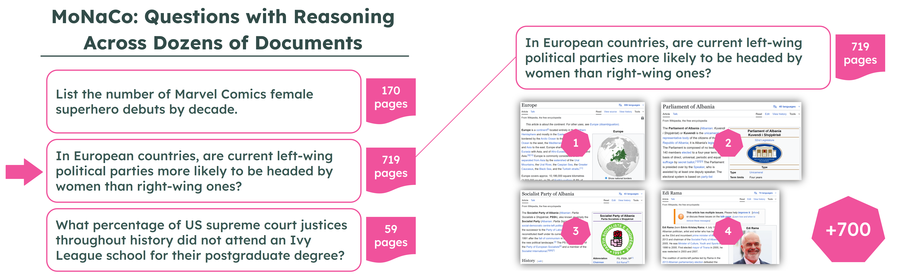

## **Reasoning across Dozens of Documents**

MoNaCo, a benchmark of More Natural and Complex questions to evaluate the question-answering (QA) skills of language models. MoNaCo contains [1,315](https://huggingface.co/datasets/allenai/MoNaCo_Benchmark) time-consuming questions whose solutions involve combining and reasoning over information spanning across dozens of Wikipedia tables and passages. Compared to traditional QA benchmarks, the scope of MoNaCo questions is much broader. To solve them, models must be proficient at decomposing complex queries, locating hundreds of pieces of information, and reasoning, combining, and aggregating this data effectively.

This benchmark was created by a team of [NLP researchers](#authors) at the [University of Pennsylvania](https://cogcomp.seas.upenn.edu/), the [Allen Institute for AI](https://allenai.org/), [Tel Aviv Univeristy](https://mega002.github.io/) and [Bar-Ilan University](https://nlp.biu.ac.il/~rtsarfaty/onlp).


For more details on Break, please refer to our [TACL 2025 paper](#paper), and to our [Ai2 blogpost](#paper).  

<center>
    <a href="https://allenai.github.io/Break/images/qdmr01.png"> 
        
      </a>
</center>

## **Overview**

<center>
    <a href="https://tomerwolgithub.github.io/monaco/images/image01_questions.png"> 
        
      </a>
</center>


MoNaCo is a question answering benchmark of natural time-consuming questions, where each question requires combining information from dozens of Wikipedia pages.

We collected 1,315 human-written questions that reflect the goals of real-world users (political scientist, sports buff, amateur chef, etc.). Each question is also manually annotated with its gold-standard reasoning chain containing all: (1) intermediate questions, (2) answers and (3) Wikipedia evidence.

<center>
    <a href="https://tomerwolgithub.github.io/monaco/images/image02_reasoning.png"> 
        
      </a>
</center><br>

We evaluated MoNaCo in a question-answering setting, testing 15 frontier language models including GPT-5, o3, Claude Opus 4, Gemini 2.5 Pro, DeepSeek R1. These models predictions are released alongside our QA data, to help researchers better assess models factuality. To reproduce our evaluation, please refer to our LLM-as-judge prompt and evaluation script [available here](https://github.com/tomerwolgithub/monaco/tree/main/prompts). 
MoNaCo was released in August 2025, when the top performing model, OpenAI o3 scores only 61% F1 while reaching a perfect score on only 38.7% of the examples. 

While our paper centers on QA evaluation, the breadth and depth of MoNaCo questions makes it an ideal evaluation benchmark for at least five settings:

* Evaluating models’ **parametric knowledge** and reasoning
* Measuring **complex reasoning over long contexts**, where all of the evidence docs are provided in the context
* **Multi-document retrieval** performance
* End-to-end **retrieval-augmented generation** (RAG)
* **Training Deep Research-like systems**, using the gold standard reasoning chains

<br>


## **Paper**

[**MoNaCo: More Natural and Complex Questions for Reasoning Across Dozens of Documents**](https://arxiv.org/abs/2001.11770v1)  
Tomer Wolfson, Harsh, Trivedi, Mor Geva, Yoav Goldberg, Dan Roth, Tushar Khot, Ashish Ashish Sabharwal and Reut Tsarfaty  
*To appear in the Transactions of the Association for Computational Linguistics (TACL), 2025*  

```markdown
@article{wolfson-etal-2025-monaco,
    title = "MoNaCo: More Natural and Complex Questions for Reasoning Across Dozens of Documents",
    author = "Wolfson, Tomer  and
      Trivedi, Harsh  and
      Geva, Mor  and
      Goldberg, Yoav  and
      Roth, Dan  and
      Khot, Tushar  and
      Sabharwal, Ashish  and
      Tsarfaty, Reut",
    journal = "Transactions of the Association for Computational Linguistics",
    address = "Cambridge, MA",
    publisher = "MIT Press",
    year="2025",
}
```

## **Authors**

<div>
<div class="card">
  
  <div class="container">
    <a href="https://tomerwolgithub.github.io/">
    <h4><b>Tomer Wolfson</b></h4>  
    </a>
  </div>
</div>
<div class="card">
  
  <div class="container">
    <a href="https://harshtrivedi.me/">
    <h4><b>Harsh <br>Trivedi</b></h4>  
    </a>
  </div>
</div>
<div class="card">
  
  <div class="container">
    <a href="https://mega002.github.io/">
    <h4><b>Mor <br>Geva</b></h4>  
    </a>
  </div>
</div>
<div class="card">
  
  <div class="container">
    <a href="https://www.cs.bgu.ac.il/~yoavg/uni/">
    <h4><b>Yoav Goldberg</b></h4>  
    </a>
  </div>
</div>
<div class="card">
  
  <div class="container">
    <a href="https://www.cis.upenn.edu/~danroth/">
    <h4><b>Dan <br>Roth</b></h4>  
    </a>
  </div>
</div>
<div class="card">
  
  <div class="container">
    <a href="https://tusharkhot.github.io/">
    <h4><b>Tushar Khot</b></h4>  
    </a>
  </div>
</div>
<div class="card">
  
  <div class="container">
    <a href="https://www.cs.cornell.edu/~sabhar/">
    <h4><b>Ashish Sabharwal</b></h4>  
    </a>
  </div>
</div>
<div class="card">
  
  <div class="container">
    <a href="https://nlp.biu.ac.il/~rtsarfaty/onlp">
    <h4><b>Reut Tsarfaty</b></h4>  
    </a>
  </div>
</div>
</div>


## **Leaderboard**

For the most up-to-date results please refer to the [MoNaCo Leaderboard page](https://tomerwolgithub.github.io/monaco/leaderboard.html).


## **Download**

- For the full documentation of the dataset and its format please refer to our [HuggingFace repository](https://huggingface.co/MoNaCo-Release/).
